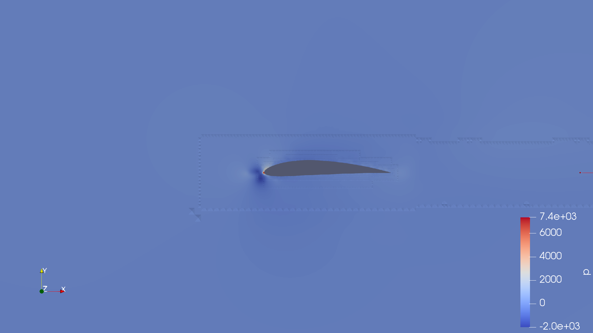
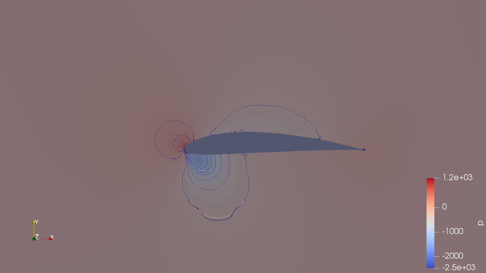

# CFD Simulation – NACA4412 Airfoil

## Objective
Steady incompressible RANS simulation of the NACA4412 airfoil using **OpenFOAM** for solving and **ParaView** for post-processing.  
Aim: visualize pressure distribution and flow features around the airfoil.

---

## Setup
- **Solver:** `simpleFoam` (steady RANS, incompressible)  
- **Turbulence model:** k-ω SST  
- **Reynolds number:** ~5×10⁵ (U∞ ≈ 15 m/s, c = 1 m, ν = 1.5e-5 m²/s)  
- **Domain:** rectangular far-field around the airfoil, generated with `snappyHexMesh`  
- **Boundary conditions:**  
  - Inlet: uniform velocity  
  - Outlet: fixed pressure  
  - Airfoil: no-slip wall  
  - Top/Bottom: far-field  

---

## Results

### Pressure distribution (slice)

---

### Streamlines colored by velocity magnitude

---

### Pressure contours

---

## 📝 Remarks
This case demonstrates the full workflow of a **basic CFD simulation in OpenFOAM**:
1. Mesh generation around an external aerodynamics geometry (airfoil).  
2. RANS k-ω SST simulation with `simpleFoam`.  
3. Post-processing in ParaView (slice, streamlines, contour).  

